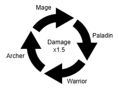
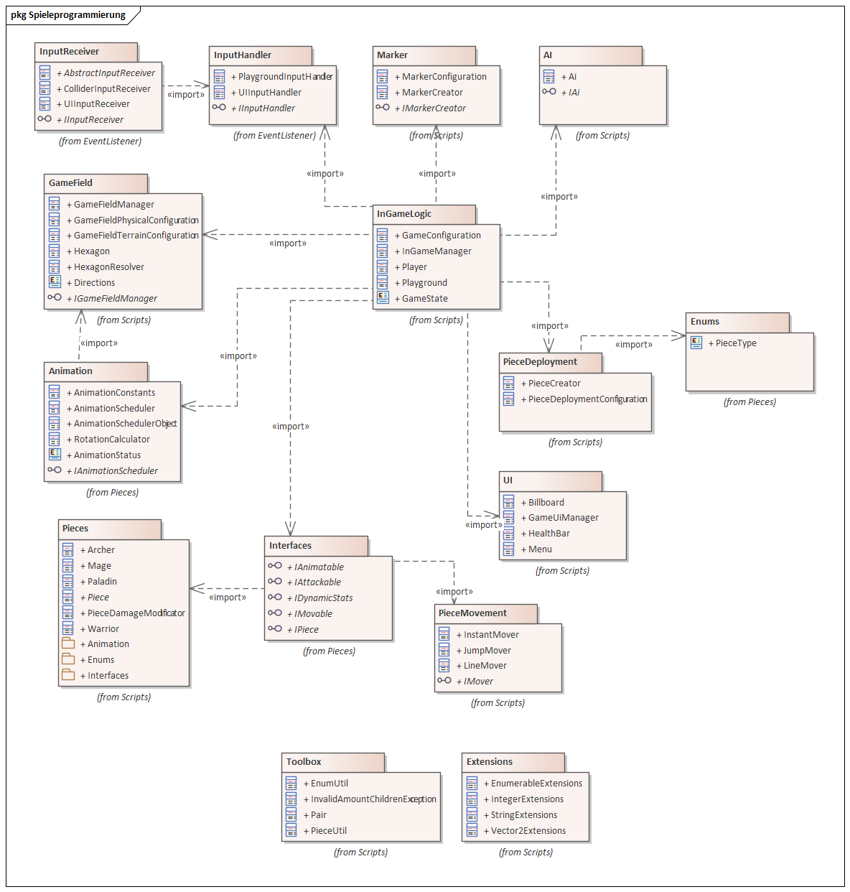

# ⚔️ The Warrior’s Memory

**The Warrior’s Memory** is a tactical 2.5D turn-based strategy game, designed and developed in **Unity** during my time at **Aalen University**.

Fight a battle of wits and strategy against a clever AI opponent! Move your units wisely, take advantage of terrain, and exploit character class synergies to emerge victorious.

---

## 🎮 Gameplay Overview

In this turn-based fantasy battle, you control six unique characters:

- 🛡️ 2 Warriors
- 🏹 2 Archers
- 🔮 1 Mage
- ✝️ 1 Paladin

The AI controls an identical team. You and the enemy take turns moving and attacking with each character on a **hexagonal battlefield**.  
Movement and attack ranges are visually indicated using blue and red hex markers.

For more information there is also a full product and project documentation in german.
For a brief outline of the project have a look at the game presentation.

📜 [Presentation  (PDF)](docs/Presentation.pdf)

📜 [Projectdocumentation  (PDF)](docs/Projektdokumentation.pdf)

📜 [Productdocumentation (PDF)](docs/Produktdokumentation.pdf)

---

## 🕹️ How to Play

- ⚔️ The game can be started by selecting "new game"
- 🔁 Turns are taken alternately by both teams for all units of that team
- 🔥 The current active unit is marked on the battlefield
- 🚶 Blue markers = movement options
- 🎯 Red markers = valid attack targets
- ⌨️ Press `ESC` to pause or return to the main menu

The battle continues until one side has no units left. A win screen lets you start over or exit.

---

## 🎨 Visual Style

- Cel-Shaded 3D characters on a clean stylized grid
- Combined use of low-res pixel backgrounds and high-res 3D units
- Audio and animation for every class: idle, move, attack, hit, and death

---

## 🧠 Strategic Depth

Each character class is effective against another – this “advantage circle” adds a layer of tactical depth.

- ✅ Attacking an enemy you counter will deal **+50% damage**
- ❌ Attacking an enemy that counters you may result in disadvantageous trades

// add here some text that each unit has different stats

| Character Type | Count | Health       | Damage     | Attack Range | Movement Range |
|----------------|-------|--------------|------------|---------------|-----------------|
| Mage           | 1     | Low (30)     | High (20)  | Medium (3)    | Low (1)         |
| Archer         | 2     | Medium (50)  | Low (10)   | Medium (3)    | High (3)        |
| Paladin        | 1     | Very High (150)| Low (10) | Low (1)       | Low (1)         |
| Warrior        | 2     | High (85)    | High (20)  | Low (1)       | Medium (2)      |

Use this mechanic wisely to:

- Eliminate dangerous enemies first
- Keep your support units safe

Use terrain to your advantage:
 - mountains and lakes block movement
 - units will block movement of other units on their field

---

## 🤖 Smart AI

The AI uses a simple but effective evaluation system:

- 📌 Prioritizes low-health or high-damage enemies for attacks
- 📈 Tries to maximize distance when safe, or close gaps when in range
- 🚫 Avoids unnecessary danger when possible

You’ll need to think ahead and position carefully!

---

## 🔧 Technologies Used

- 🎮 Unity (C#)
- 🎞️ Custom animation scheduler for timed actions
- 📊 ScriptableObject-driven setup and runtime logic
- 🔊 Audio feedback for every action and animation

## 🔧 Design
A brief overview of the games logic structure can be seen in the package diagram below:

The correspondig .eapx file (Enterprise Architect) can be found [here](docs/enterprisearchitect/architecture.eapx).
---

## 🧑‍💻 Teamwork makes the Dream Work

Developed by:

- Simon Ruttmann
- Veronika Scheller
- Michael Ulrich

---

## 📜 License

This project is licensed under the [Apache 2.0 License](LICENSE).  
Feel free to fork or adapt it — just give credit. 🤝

---

## 📦 Download & Releases

Want to play?

➡️ **[Click here to download the latest release](https://github.com/SimonRuttmann/TheWarriorsMemory/releases/tag/v1.0.0)**

---

## 🎥 Videos

🎬 [Watch Gameplay (MP4)](media/video/gameplay.mp4)